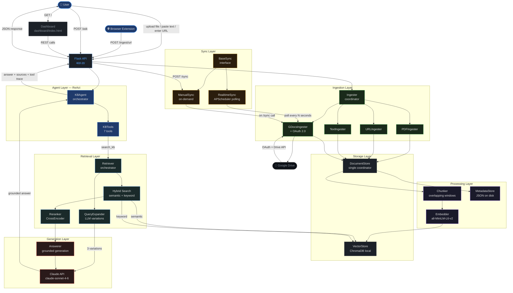

# Phoenix Knowledge Base Architecture

## Architecture Overview

This diagram shows the complete architecture of the Phoenix Knowledge Base system, including:

- **External Inputs**: User interactions, browser extension, and Google Drive integration
- **API Layer**: Flask REST API serving as the central coordinator
- **Ingestion Layer**: Multiple ingesters for different content types
- **Sync Layer**: Manual and real-time synchronization mechanisms
- **Processing Layer**: Text chunking, embedding generation, and metadata management
- **Storage Layer**: Document storage and vector database
- **Retrieval Layer**: Hybrid search with query expansion and reranking
- **Generation Layer**: Grounded answer generation using Claude API
- **Agent Layer**: ReAct-based knowledge base agent with tools
- **Dashboard**: Web interface for system interaction
